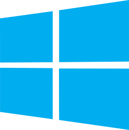

# Getting Started
{: .no_toc }

---

  

    Table of Contents
  

  {: .text-delta }
1. TOC
{:toc}

---

## Downloading Stash

| Windows | macOS | Linux | Docker |
|:---:|:---:|:---:|:---:|
|  |  |  |  |
| [Latest Release](https://github.com/stashapp/stash/releases/latest/download/stash-win.exe)   [Development Preview](https://github.com/stashapp/stash/releases/download/latest_develop/stash-win.exe) | [Latest Release (Apple Silicon)](https://github.com/stashapp/stash/releases/latest/download/stash-macos-applesilicon)   [Development Preview (Apple Silicon)](https://github.com/stashapp/stash/releases/download/latest_develop/stash-macos-applesilicon)  [Latest Release (Intel)](https://github.com/stashapp/stash/releases/latest/download/stash-macos-intel)   [Development Preview (Intel)](https://github.com/stashapp/stash/releases/download/latest_develop/stash-macos-intel) | [Latest Release (amd64)](https://github.com/stashapp/stash/releases/latest/download/stash-linux)   [Development Preview (amd64)](https://github.com/stashapp/stash/releases/download/latest_develop/stash-linux)   [More Architectures...](https://github.com/stashapp/stash/releases/latest) | [Instructions](docker/production/README.md)    [Sample docker-compose.yml](docker/production/docker-compose.yml) |