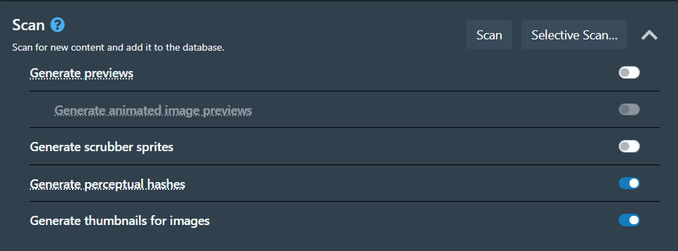

# Configuring Scan Options
{: .no_toc }

---

  

    Table of Contents
  

  {: .text-delta }
1. TOC
{:toc}

---

1. Open your Stash.
2. Go to `Settings` > `Tasks`.

| Option | Description |
|--------|-------------|
| Generate previews | Generates video previews which play when hovering over a scene. |
| Generate animated image previews | Generates animated webp previews. Only required if the Preview Type is set to Animated Image. Requires Generate previews to be enabled. |
| Generate scrubber sprites | Generates sprites for the scene scrubber. |
| Generate perceptual hashes | Generates perceptual hashes for scene deduplication and identification. |
| Generate thumbnails for images | Generates thumbnails for image files. |
3. Select options you want based on your preferences, but every option increases time the scan will take. 
4. You can stop and re-scan it will ignore the files that are already scanned and just scan new or missing files. 