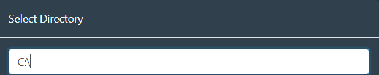

# Setting Up Content Libraries
{: .no_toc }

---

  

    Table of Contents
  

  {: .text-delta }
1. TOC
{:toc}

---

1. Open your Stash.
2. Go to `Settings` > `Library` and click `Add Directory`.
3. To change the drive letter/volume, just type it in the field.

4. Select the folder containing the content you want to added. It will selects the folder and all sub-folders. 
5. Click `Confirm`.