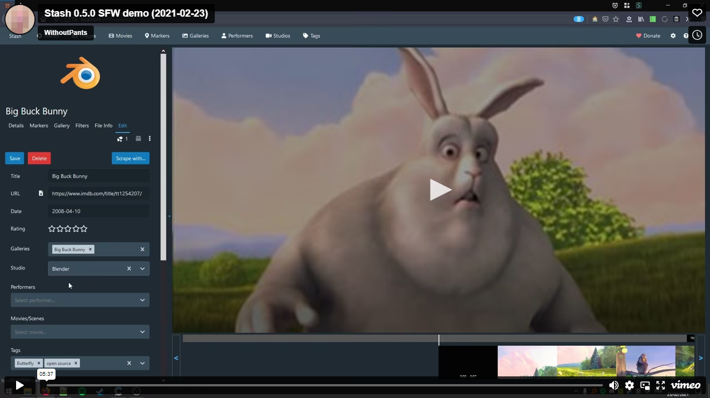

# Stash-Docs
{: .no_toc }
**Stash documentation**

Stash is a web front-end app for serving and organizing your porn. Stash currently supports Windows, Linux, and macOS. To download Stash see the [latest releases](https://github.com/stashapp/stash/releases). You can learn more about the software generally via the [README](https://github.com/stashapp/stash/blob/master/README.md) or find answers to [FAQ]({{ site.baseurl }}/docs/FAQ/) here.

---

  

    Table of Contents
  

  {: .text-delta }
1. TOC
{:toc}

---

## See it in Action

Checkout the (safe for work) demo video below.

")

## Getting the Latest Stash

[Synology NAS]({{ site.baseurl }}/docs/Installing-on-Synology-NAS) • [UNRAID]({{ site.baseurl }}/docs/Unraid-Support) • [TrueNAS/FreeNAS]({{ site.baseurl }}/docs/Installing-on-FreeNAS-TrueNAS) • [Using A Reverse Proxy]({{ site.baseurl }}/docs/Reverse-proxy)

---

## Advanced Configuration And Troubleshooting

[Command-Line Flags]({{ site.baseurl }}/docs/Advanced-Configuration-Options) • [Troubleshooting Video Playback Issues]({{ site.baseurl }}/docs/Troubleshooting-video-playback-issues)

---

## Customizing and Expanding Functionality

[Theme Directory]({{ site.baseurl }}/docs/Themes) • [Custom CSS Snippets]({{ site.baseurl }}/docs/Custom-CSS-snippets) • [Plugins/Scripts]({{ site.baseurl }}/docs/Plugins-&--Scripts) • [Scrapers]({{ site.baseurl }}/docs/Scrapers)

---

## Working With The Database

[Backup & Restore]({{ site.baseurl }}/docs/Backup-&-Restore-Database) • [Importing from a CSV file]({{ site.baseurl }}/docs/Importing-via-CSV-using-gql-iterate) •  [Manually Editing The Database]({{ site.baseurl }}/docs/Manually-Editing-the-Stash-Sqlite3-database)

---

## Working With Collections

[Excluding Files From Scans]({{ site.baseurl }}/docs/Exclude-file-configuration)

---

## API

[API Reference]({{ site.baseurl }}/docs/API) • [JSON Specification]({{ site.baseurl }}/docs/JSON-Specification) 

---

## GUI Front Ends

[(Unofficial) Stash Helper - Windows only](https://github.com/philpw99/Stash_Helper)